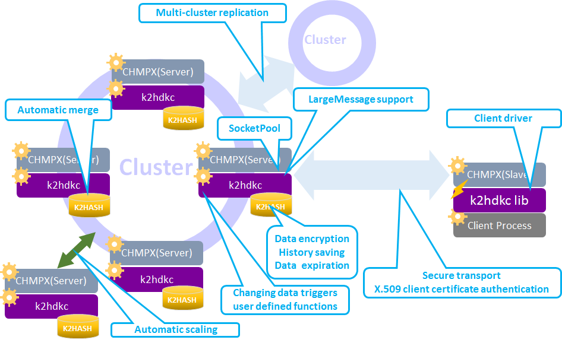

# What is the k2hdkc?
**K2HDKC** (**K2H**ash based **D**istributed **K**vs **C**luster) is a free and open-source distributed KVS(Key Value Store) clustering system created in Yahoo! JAPAN.

## Background
After years of using various distributed KVS products in Yahoo! JAPAN, we need to improve performance and enhance availability, scalability and ease of use.
Therefore, we have developed the **K2HDKC** and succeeded in reducing the operational cost while maintaining the performance of [K2HASH](https://k2hash.antpick.ax/) and the scalability and availability of [CHMPX](https://chmpx.antpick.ax/).
We have already open-sourced [K2HASH](https://k2hash.antpick.ax/) and [CHMPX](https://chmpx.antpick.ax/) in 2016 which are the heart of **K2HDKC**.

### [K2HASH](https://k2hash.antpick.ax/)
The key-value store library for handling lots of key, large data size, high performance and many original function.

### [CHMPX](https://chmpx.antpick.ax/)
The data exchange through networks with each node by POSIX Message Queue(MQ) with consistent hashing system.

# Overview
More than one server node becomes one **K2HDKC** cluster. Server nodes in the cluster communicate with the client application using a driver library program that implements the **K2HDKC** API.

_Figure 1 Overview_

## Components for server nodes
A server node is based on the following three components.
### CHMPX
[CHMPX](https://chmpx.antpick.ax/) processes accept a series of communication commands from client driver library to the **K2HDKC**.

### K2HDKC
**K2HDKC** processes receive client requests via [CHMPX](https://chmpx.antpick.ax/) and handle them and manage [K2HASH](https://k2hash.antpick.ax/) database files.

### K2HASH
[K2HASH](https://k2hash.antpick.ax/) database files store data.

## Components for client application
A client application is based on the following 2 components.

### CHMPX
A [CHMPX](https://chmpx.antpick.ax/) process provides durable network communications in case of cluster node failure.

### K2HDKC driver library
A client process using a driver library program that implements the **K2HDKC** API sends communication commands to a **K2HDKC** server process.

## Availability
Every node in the cluster has the same role and data is evenly distributed among the nodes in the **K2HDKC** cluster. By default,

### The value of the [CHMPX](https://chmpx.antpick.ax/) DELIVERMODE configuration parameter is **hash**.
- This means the server containing a key is determined by the hash value of the key and the number of server nodes in the cluster.
- In the following document, the server is called **main server node**.

### The [CHMPX](https://chmpx.antpick.ax/) REPLICA setting is **1**, and the data is stored on the main server node and a replica node.
- The **replica node** is determined by clockwise of the **main server node**.

Even if [CHMPX](https://chmpx.antpick.ax/) detects an unreachable node in the cluster, [CHMPX](https://chmpx.antpick.ax/) knows that it can still reach another node with the data of the unreachable node.  
Therefore, **K2HDKC** maintains high availability.

## Consistency
In order to ensure data consistency at the time of recovery of the main server node from transient node failures, it automatically restores only data that it doesn't have from a replica node. We call this function as **Automatic Merge**.  
_Note: You can specify more than **1** REPLICA setting. If **1**, the replica node is one, but if **2**, the replica node is two units._  
When increasing or decreasing server nodes of the cluster, the data held by each server node is automatically relocated.  
This function is called **Automatic Scaling** function. The Automatic Scaling function is implemented using the same function as **Automatic Merge**.

## Storage
[K2HASH](https://k2hash.antpick.ax/) is a storage implementation of the **K2HDKC** clustering system.  
[K2HASH](https://k2hash.antpick.ax/) is greatly related to the functions of **K2HDKC**.

### K2HASH has three types of storage.

#### on memory
- Fastest read and write access guaranteed.
- Transient data store.  
Data will be discarded when **K2HDKC** process has died.
- Cost of data synchronization between replica nodes after a server process getting up again is expensive because all data should be restored.

#### mmap an entire file
- Fastest read and write access guaranteed.
- Persistent data store.
- Cost of data synchronization between replica nodes is probably reasonable because no need to get whole data but only updated data while the process is dead should be recovered.

#### mmap just part of a file
- Suitable for large file read and write access.
- Persistent data store.
- Cost of data synchronization between replica nodes is probably reasonable because no need to get whole data but only updated data while the process is dead should be recovered.
