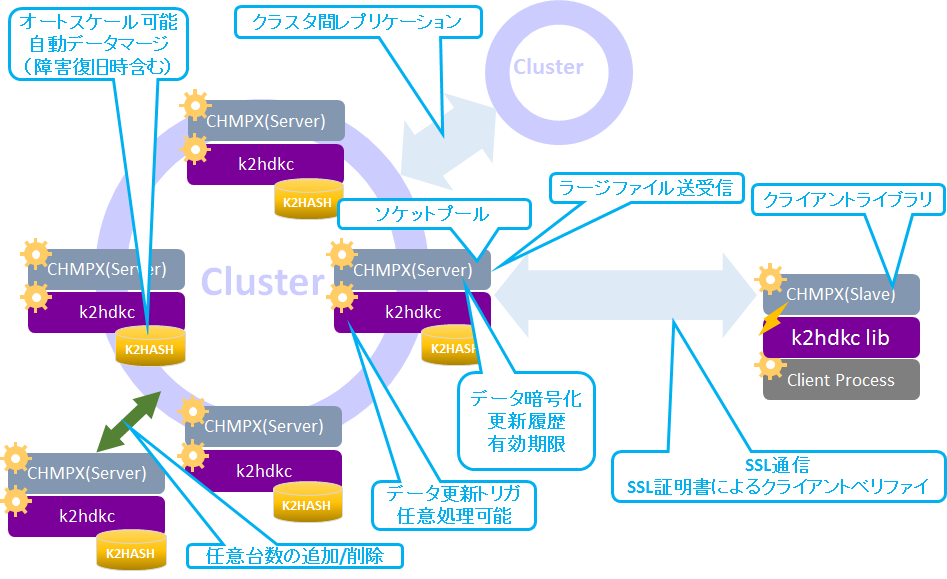

# k2hdkcとはなんですか？
**K2HDKC** (**K2H**ash based **D**istributed **K**vs **C**luster) は、Yahoo! JAPANオリジナルのNoSQL（key value store）ライブラリk2hashをベースとしたオープンソースの分散KVS（Key Value Store）です。

## 背景
Yahoo! JAPANではさまざまな分散KVS製品を使っていますが、**K2HDKC**は、[K2HASH](https://k2hash.antpick.ax/indexja.html)をベースに、高速、高可用性、拡張性、低メンテナンスコストなどを目的として開発されました。  
**K2HDKC**という分散KVSを作ることで、[K2HASH](https://k2hash.antpick.ax/indexja.html) の性能と[CHMPX](https://chmpx.antpick.ax/indexja.html) のスケーラビリティと冗長性を維持しつつ、運用コストをさげることにも成功しました。  
[K2HASH](https://k2hash.antpick.ax/indexja.html) と[CHMPX](https://chmpx.antpick.ax/indexja.html) は、2016年にすでにオープンソース化されている製品です。

### [K2HASH](https://k2hash.antpick.ax/indexja.html)
大量のキーやデータを扱える、高速かつオリジナルな機能を持ったkvsライブラリ
### [CHMPX](https://chmpx.antpick.ax/indexja.html)
ネットワークをまたぐプロセス間におけるバイナリ通信を行うための通信ミドルウエア

# 概要
**K2HDKC**クラスタは、複数のサーバーノードで構成されています。**K2HDKC**へアクセスするクライアントプログラムからは**K2HDKC**ライブラリのAPIを利用するだけでアクセスできる構成となっています（図1を参照）。

_図1. 概要_

## サーバーノードの構成
サーバーノードは、[K2HASH](https://k2hash.antpick.ax/indexja.html)データ、[CHMPX](https://chmpx.antpick.ax/indexja.html)（サーバーノード）、および **K2HDKC** プログラムで構成されています。

### CHMPX（サーバーノード）
**K2HDKC** プログラムおよび[K2HASH](https://k2hash.antpick.ax/indexja.html)への操作は[CHMPX](https://chmpx.antpick.ax/indexja.html)プロセスを通した通信コマンドで実現されています。

### K2HDKC
**K2HDKC**プログラムが、[CHMPX](https://chmpx.antpick.ax/indexja.html)（サーバーノード）からの通信コマンドを処理し、[K2HASH](https://k2hash.antpick.ax/indexja.html)ファイルを管理し、操作します。

### K2HASH
[K2HASH](https://k2hash.antpick.ax/indexja.html)ファイルにはデータが保存されます。

## クライアントプログラムの構成
クライアントは、2つのコンポーネントで構成されます。

### CHMPX
[CHMPX](https://chmpx.antpick.ax/indexja.html) プロセスは、クラスタのサーバーノードの障害があった場合でも、耐久性のある通信を提供します。

### **K2HDKC**ライブラリを利用したクライアントプロセス
[CHMPX](https://chmpx.antpick.ax/indexja.html) を通して通信コマンドで**K2HDKC**クラスタの操作を行います。

## 可用性
**K2HDKC**クラスタ内のすべてのノードは同じ役割を持ち、データは**K2HDKC**クラスタのノード間で均等に分散されます。

### **hash**値 による分散
- [CHMPX](https://chmpx.antpick.ax/indexja.html)のDELIVERMODE設定値などに依存して、データの保管ノードが決定されます。
- 対象となるhash値（キーにより求められる）を持つサーバーは、ハッシュ値とクラスター内のサーバーノードの数によって決まります。
- 以降の説明では、メインとなる対象のノードを **メインサーバーノード** と呼びます。

### データの複製
- データは、必ず**メインサーバーノード**に保管されます。
- [CHMPX](https://chmpx.antpick.ax/indexja.html)のREPLICA設定の値に応じて、**K2HDKC**クラスタ内にデータの複製を持つことができます。
- REPLICA値が**1**の場合には、複製が**1**つ作られます。
- 複製を持つ**K2HDKC**クラスタのノードを、**レプリカノード**と呼びます。
- **レプリカノード**は、**メインサーバーノード**の時計回り（**hash値**に応じて時計回りにノードが配置されていると仮定して）に決定されます。

### 障害発生時
**K2HDKC**クラスタのノードに障害が発生し、クライアントプログラムが**メインサーバーノード**に到達できない場合、自動的に**レプリカノード**から目的のデータにアクセスできます。  
**レプリカノード**の数を調整することにより、高可用性を実現できます。

## 一貫性
**メインサーバーノード**の障害復旧後、データ一貫性を保証するために、**メインサーバーノード**は復旧後に自動的に**レプリカノード**からデータを復元します。この機能を **Automatic Merge** と呼びます。  
_補足：CHMPXのREPLICA値を**1**以上の設定が可能です。 **2**の場合、レプリカノードは2ノードになります。_  
**K2HDKC**クラスタのノードを増減する場合、各サーバーノードが保持するデータは自動的に再配置されます。この機能を**Automatic Scaling**機能と呼びます。

## ストレージ
**K2HDKC**クラスタが使うストレージは、[K2HASH](https://k2hash.antpick.ax/indexja.html) で実装されています。  
**K2HDKC**と、[K2HASH](https://k2hash.antpick.ax/indexja.html) は密接に関係しています。

### K2HASHの3種類のデータ保管方法
**K2HDKC**クラスタのデータの保管方法は、[K2HASH](https://k2hash.antpick.ax/indexja.html) に依存してます。  
[K2HASH](https://k2hash.antpick.ax/indexja.html)は、データを以下の3種類のいずれかの方法で保管することができ、**K2HDKC**クラスタでも同様に3つの方法が提供されます。

#### メモリ
- オンメモリ（揮発）上にデータを保管します。
- 高速な読み込み/書き込みができます。
- 一時的な保管  
データは、**K2HDKC**プロセスの終了とともに消えます。
- 復元  
**K2HDKC**クラスタノードの障害発生後に復旧した場合、すべてのデータを復元する必要があるため、再起動後のレプリカノード間のデータ同期コストは高価です。

#### フルマッピングファイル
- ファイルにデータを保管し、そのファイルをmmapした状態でアクセスします。
- 高速な読み込み/書き込みができます。
- データは永続的に利用できます。
- 復元  
**K2HDKC**クラスタノードの障害発生後に復旧した場合、差分のデータのみ復元するため、再起動後のレプリカノード間のデータ同期コストは適切で最小となります。

#### 部分的なマッピングファイル
- ファイルにデータを保管し、そのファイルの一部分のみ（インデックスのみ）をmmapした状態でアクセスします。
- 大容量データの保管に適しています。
- データは永続的に利用できます。
- 復元  
**K2HDKC**クラスタノードの障害発生後に復旧した場合、差分のデータのみ復元するため、再起動後のレプリカノード間のデータ同期コストは適切で最小となります。

